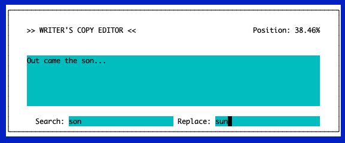

# Copy Editing Assistant for Writers

**A quick utility for writers. Writers know it's a pain to catch the typos and grammar errors in every sentence, especially when they've been staring at the article/story/manuscript for days, weeks, or years.** 

A common piece of advice to get around this *write-blindness* is to read the piece backwards, sentence by sentence, so one don't get swept away in the narrative flow. 

We solve that problem with "Copy Editing Assistant for Writers." This script is already in production use by our third-favorite author.

## How it works

This script reads your markdown `.md` file. It randomly shuffles all the sentences and presents them to you one at a time. You can then do a search / replace thing to correct the errors that now jump out at you. 

Use `TAB` to move between the inputs, `CURSOR LEFT` and `CURSOR RIGHT` jump through the sentences. `ENTER` saves your search/replace changes to a sentence and then advances to the next unseen sentence. 

The script remembers the original order of the sentences, empty lines and all, and saves a revised version (named `your_path/your_filename-OUTPUT.md`) every time you change a sentence. Formatting is also preserved because the formatting is in markdown. Writing tools like Scrivener can jump back and forth between rich text and markdown.

## Details

It's the simplest thing in the world. All the work was in getting the text user interface (TUI) to behave correctly. That's still a work in progress. 

The text is split into sentences using terminal punctuation (`.`, `!`, `?`, `...`, `....`) but pays attention to double quotes and markdown formatting for italics and boldface (`*`, `_`, `**`). If text inside quotes is in multiple sentences, then those sentences are split too. 

The code is not smart enough to handle nonterminal periods (like `Dr.`, `Mrs.`, etc). A sentence like:

> Why, Ms. Emma, you are a bouquet of cynicism today.

...will be split into two sentences:

> Why, Ms.

...and then:

> Emma, you are a bouquet of cynicism today.

Ergo, sometimes the sentences you're presented are odd or confusing. In those circumstances, just bull through like the proud battleship of language you are. *Rule Brittania!*

(And yes, we know that `...` ellipses is not terminal punctuation, but darned if it isn't treated that way by the 99%.)

## Requests, updates, comments?

We know you haven't read this far.